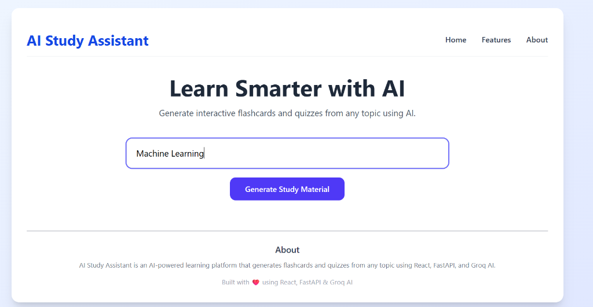
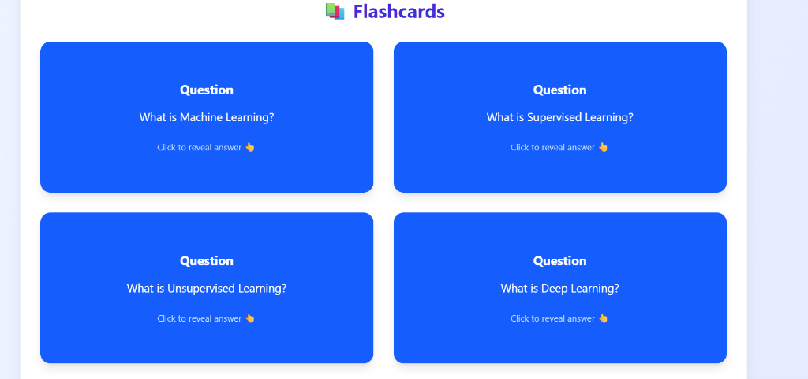
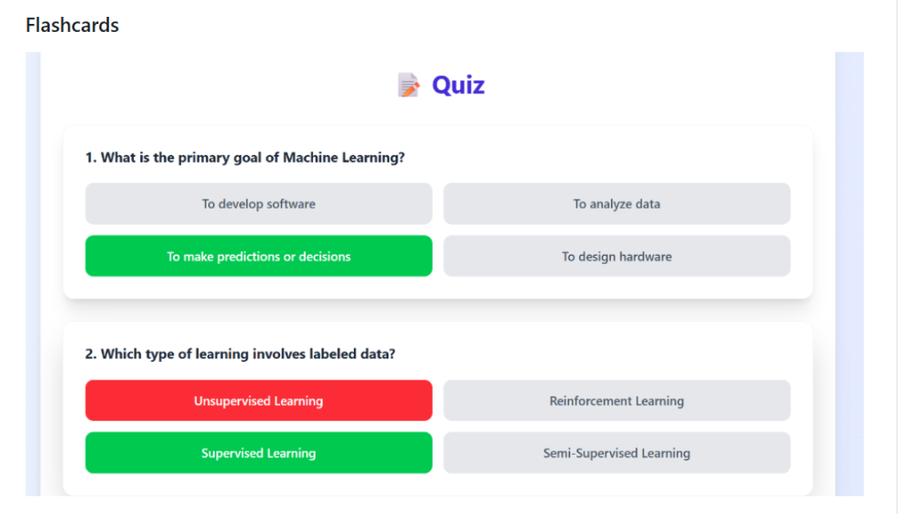

# AI Study Assistant 

## 🌐 Live Demo

- **Frontend**: [https://ai-study-assistant-eight-sigma.vercel.app/](https://ai-study-assistant-eight-sigma.vercel.app/)
- **Backend API**: [https://ai-study-assistant-7ygf.onrender.com](https://ai-study-assistant-7ygf.onrender.com)

A modern, fast, and interactive study assistant that generates tailored **flashcards** and **quizzes** on any topic you want to learn. It uses the Groq API using Meta's Llama 3.3 70B Versatile model for generating structured study material, and has a sleek, responsive React dashboard on the frontend.

---

##  Screenshots

### Home Page



### Flashcards



### Quiz



### Generated PDF


---

## Features

- **Interactive Flashcards**: Flip cards to test your knowledge on any topic.
- **Dynamic Quizzes**: Automatically generated multiple-choice quizzes with instant feedback and score tracking.
- **Export to PDF**: Generate and download a print-friendly PDF of your study materials to study offline.
- **Clean UI**: Built with React, Vite, and Tailwind CSS v4 for a highly fluid user experience.

---

##  Additional Features

- Loading and error handling
- Request cancellation to prevent stale API responses
- Interactive flashcards with flip animations
- Quiz scoring with instant feedback
- PDF export
- Responsive design

---

## Tech Stack

### Frontend
- **React (Vite)** — For a blazing fast development build and SPA interface.
- **Tailwind CSS v4** — Modern styling and layout utilities.
- **Axios** — Seamless HTTP communication with the backend.
- **jsPDF** — For client-side PDF generation.
- **React Icons** — Clean, modern iconography.

### Backend
- **FastAPI** — High-performance, lightweight Python web framework.
- **Groq SDK** — Integration with Groq Cloud APIs using Meta's Llama 3.3 70B Versatile model for generating structured study material.
- **Uvicorn** — ASGI server for running the FastAPI application.
- **Pydantic** — Strict data validation schemas.

---

## Getting Started

Follow these steps to set up the project locally on your machine.

### Prerequisites
Make sure you have the following installed:
- **Node.js** (v18 or higher recommended)
- **Python** (v3.9 or higher recommended)
- A **Groq API Key** (Get one for free at [Groq Console](https://console.groq.com/))

---

### Step 1: Backend Setup

1. Open your terminal and navigate to the backend directory:
   ```bash
   cd backend
   ```

2. Create a Python virtual environment:
   ```bash
   python -m venv venv
   ```

3. Activate the virtual environment:
   - **Windows (Command Prompt):**
     ```cmd
     venv\Scripts\activate.bat
     ```
   - **Windows (PowerShell):**
     ```powershell
     .\venv\Scripts\Activate.ps1
     ```
   - **macOS/Linux:**
     ```bash
     source venv/bin/activate
     ```

4. Install the backend dependencies:
   ```bash
   pip install -r requirements.txt
   ```

5. Set up your environment variables:
   Create a `.env` file inside the `backend` directory and add your Groq API key:
   ```env
   GROQ_API_KEY=gsk_your_actual_groq_api_key_here
   ```

6. Start the FastAPI development server:
   ```bash
   uvicorn app:app --reload
   ```
   The backend will now be running at `http://127.0.0.1:8000`.

---

### Step 2: Frontend Setup

1. Open a new terminal window and navigate to the frontend directory:
   ```bash
   cd frontend
   ```

2. Install the frontend dependencies:
   ```bash
   npm install
   ```

3. Start the Vite development server:
   ```bash
   npm run dev
   ```
   The frontend will now be running at `http://localhost:5173`. Open this URL in your web browser to start studying!

---

## Project Structure

```text
├── backend/
│   ├── app.py             # FastAPI server and routes
│   ├── prompt.py          # Structured system prompt for Groq
│   ├── requirements.txt   # Python dependencies
│   ├── schema.py          # Data validation models
│   └── .env               # API keys (ignored by git)
├── frontend/
│   ├── public/
│   │   └── screenshots/   # App screenshots
│   ├── src/
│   │   ├── components/    # Reusable UI pieces (FlashCard, Quiz, etc.)
│   │   ├── pages/         # Page layouts (Home)
│   │   ├── services/      # API axios setup
│   │   ├── App.jsx        # Main application component
│   │   └── main.jsx       # App entrypoint
│   ├── vite.config.js     # Vite configuration
│   └── package.json       # Node dependencies and scripts
└── screenshots/           # App screenshots for README
```

---

## How It Works Under the Hood

1. **User input**: You type a topic (e.g., "Photosynthesis") on the home page.
2. **API Request**: The frontend makes a POST request to `/generate` with the topic.
3. **AI Generation**: FastAPI constructs a system prompt requesting strict JSON containing both flashcards and multiple-choice questions, and queries Groq's Llama 3.3 70B Versatile model.
4. **Validation**: FastAPI parses the JSON, validates it against structure definitions, and returns the response.
5. **Interactive UI**: The React app renders the flashcards (with flip animations) and the quiz (with progress trackers and score calculators).

---

##  Future Improvements

- User authentication
- Study history
- Difficulty levels
- Dark mode
- AI-generated summaries
- Progress tracking
- Multiple language support

---

##  AI Usage

This project was developed with assistance from AI tools (ChatGPT) for brainstorming, debugging, code review, and improving the project structure. All implementation details, integration, testing, and final code were reviewed, modified, and understood before submission.

---

##  Known Limitations

- The quality of generated flashcards and quizzes depends on the AI model.
- The backend is hosted on Render's free tier, so the first request after inactivity may take longer while the service wakes up.
- The application currently does not save study history or user sessions.

---

##  Time Spent

Approximately 8 hours.

---

## 👨‍💻 Author

**Saicharan Bagadi**

GitHub: [https://github.com/Saicharan345](https://github.com/Saicharan345)
